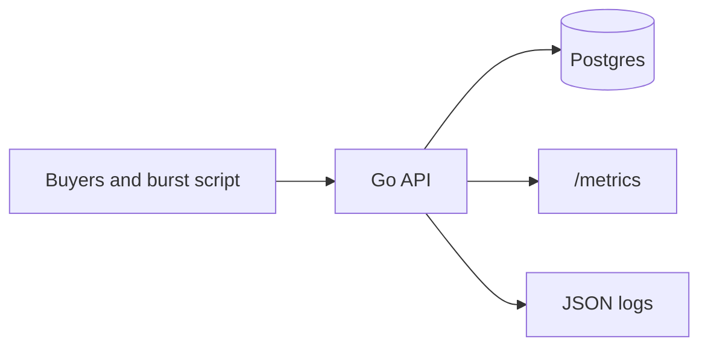
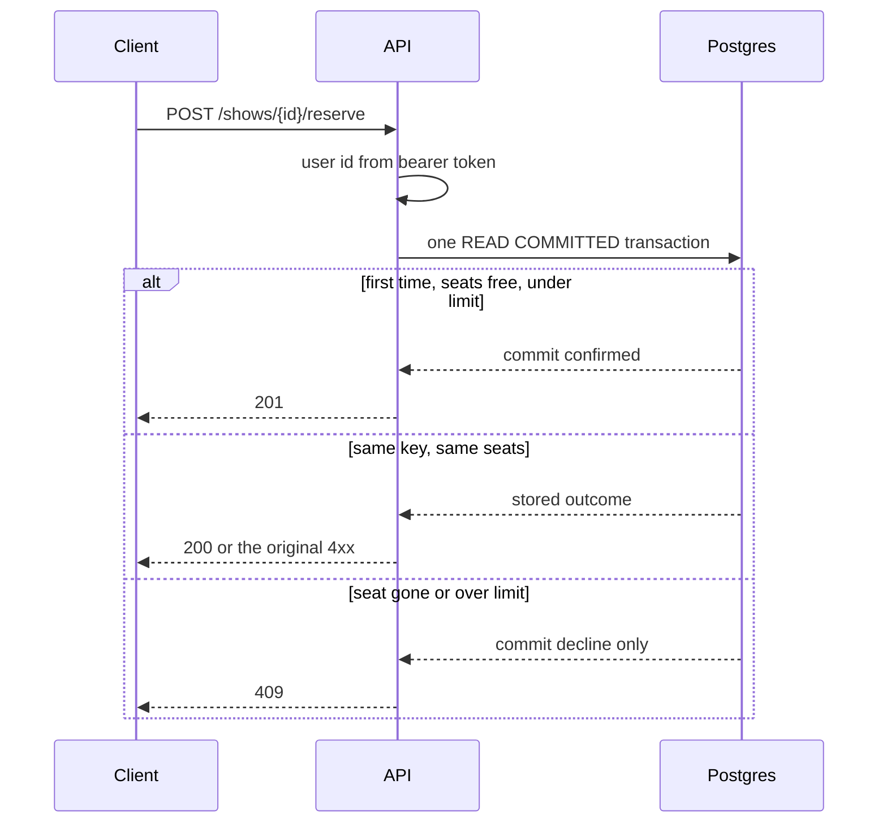
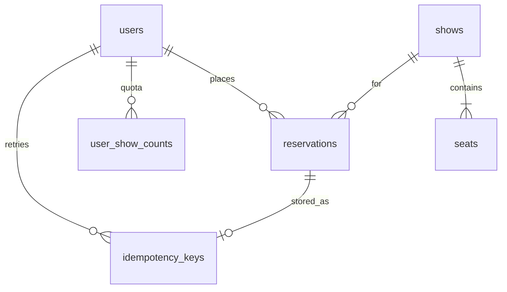

# Seat reservation

JSON API that sells assigned seats for one show. A seat is confirmed to at most one user, a user cannot pass the per-show limit, and a repeated idempotency key does not create a second reservation. Money is integer paise.

The sale decision is one Postgres transaction: lock the buyer's quota row, lock the requested seats in label order, and update a seat only while its status is `available`. Failure modes and what to page on are in [WRITEUP.md](WRITEUP.md).

## High-level design

One Go process is the system of record in front of one Postgres primary. There is no cache, queue, or second writer. A seat changes owner only when a transaction commits.



| Piece | Role |
| --- | --- |
| `cmd/server` | HTTP process. Migrate on startup, then serve. |
| `cmd/burst` | One-command on-sale storm. Not part of the request path. |
| Postgres | Seats, quotas, reservations, idempotency keys. |
| `/health/ready` | `SELECT 1`. Returns 503 when the database is unreachable, so the platform stops sending traffic. |
| `/metrics` | Counters in the process. Seat gauges are queried from Postgres on each scrape. |

A reserve either commits one outcome or changes nothing. Declines are 4xx. A lost database connection is a 500, because the server does not guess whether the seat was sold.



Invariant on every show: `available + held + confirmed = total_seats`. `held` stays 0. Reserve confirms immediately, and release is `POST /reservations/{id}/cancel`.

## Low-level design

### Layout

```
cmd/server          process entry, pool, graceful shutdown
cmd/burst           load client
internal/httpapi    routes, auth checks, status codes, request logs
internal/auth       HS256 tokens, constant-time admin compare
internal/config     environment
internal/metrics    Prometheus counters and seat gauges
internal/store      schema, SQL, the atomic reserve and cancel
internal/integration  concurrency test against a local Postgres
```

`internal/store` is the only package that talks to Postgres. Handlers do not run SQL. The burst client uses the public HTTP API only.

### Tables



| Table | What one row means |
| --- | --- |
| `seats` | One physical seat. Primary key `(show_id, seat_label)`. Status `available`, `held`, or `confirmed`. |
| `user_show_counts` | How many seats this user currently has confirmed for this show. |
| `reservations` | One booking. `amount_paise` is `price_paise * seat count`, stored as `BIGINT`. |
| `idempotency_keys` | Unique on `(user_id, idempotency_key)`. Holds the request hash and the first outcome. |

### Reserve transaction

`internal/store/reserve.go`, isolation `READ COMMITTED`. Lock order is always:

1. `idempotency_keys` for `(user_id, idempotency_key)`
2. `user_show_counts` for `(user_id, show_id)`
3. `seats` rows, one `SELECT … FOR UPDATE` per label, sorted by `seat_label`

Steps inside that transaction:

1. Insert the idempotency key with `ON CONFLICT DO NOTHING`. The loser waits until the winner commits or rolls back.
2. If the key already has an outcome, return it and write nothing. A different seat set or show is `idempotency_mismatch`.
3. `SAVEPOINT booking`.
4. Lock the quota row and add the seat count only when `confirmed_seats + n <= per_user_limit`.
5. Lock every requested seat in label order. If any label is missing or not `available`, roll back to the savepoint, store the decline on the key, and commit that row only.
6. Otherwise update each seat with `WHERE status = 'available'`, insert the reservation, store `confirmed` on the key, and commit.

The conditional update is the sale. The row lock makes the check and the update one step. Sorting labels means two overlapping multi-seat requests cannot deadlock. Cancel locks the reservation, then the quota, then the same seat order, and clears a seat only while `reservation_id` still matches.

Deadlock (`40P01`) and serialization failure (`40001`) are retried inside the process up to three times.

### HTTP mapping

| Outcome | Status |
| --- | --- |
| New reservation | 201 |
| Replay of a confirmed reservation | 200, header `Idempotent-Replayed: true` |
| `seat_taken`, `per_user_limit`, `idempotency_mismatch` | 409 |
| Replay of a stored decline | same 4xx, plus `Idempotent-Replayed: true` |
| `unknown_seat`, bad JSON | 400 |
| Not the owner | 403 |
| Missing show or reservation | 404 |
| Database unreachable on a reserve | 500 |

## Run locally

```bash
docker compose up --build -d
```

The API listens on `http://localhost:8080`. Postgres is published on `localhost:5433` for tests. Local admin token: `dev-admin-token`.

```bash
curl -s http://localhost:8080/health/ready
```

Readiness returns 503 when Postgres cannot be reached. Liveness (`/health/live`) only checks the process.

## Auth

This is a demo identity provider. `POST /users` registers a username, or logs in if it already exists, and returns a bearer token. The token subject is the only user a request can act as. A `user_id` field in a body is ignored.

Creating a show requires `Authorization: Bearer $ADMIN_TOKEN`. User tokens cannot create shows. A user can cancel only their own reservations.

## API

[`paytm_seat_reservation.postman_collection.json`](paytm_seat_reservation.postman_collection.json) calls the live service. For local, set `baseUrl` to `http://localhost:8080` and `adminToken` to `dev-admin-token`. Run the folders from top to bottom.

### Create a show

`POST /shows` with the admin token.

```bash
curl -s -X POST http://localhost:8080/shows \
  -H "authorization: Bearer dev-admin-token" \
  -H "content-type: application/json" \
  -d '{"name":"friday-night","seats":["A1","A2","A3"],"price_paise":25000}'
```

`per_user_limit` is optional and defaults to 4 (maximum 50). `price_paise` is a JSON integer. Floats are rejected.

### Register

`POST /users`

```bash
curl -s -X POST http://localhost:8080/users \
  -H "content-type: application/json" \
  -d '{"username":"ada"}'
```

### Reserve

`POST /shows/{id}/reserve` with the user token. Send the idempotency key in the body or in the `Idempotency-Key` header. If both are set they must match.

```bash
curl -s -X POST http://localhost:8080/shows/SHOW_ID/reserve \
  -H "authorization: Bearer USER_TOKEN" \
  -H "content-type: application/json" \
  -d '{"seats":["A1"],"idempotency_key":"ada-attempt-1"}'
```

- `201` new confirmed reservation. `amount_paise` is `price_paise * seat count`.
- `200` with header `Idempotent-Replayed: true` when that key already confirmed a reservation. Same reservation id.
- `409` `seat_taken` when any requested seat is not available. No seat from the request changes hands (all-or-nothing).
- `409` `per_user_limit` when the user would hold more than the show limit.
- `409` `idempotency_mismatch` when the key was already used for a different show or a different set of seats. Seat order does not matter.
- `400` `unknown_seat` or `invalid_request`.
- A stored decline is replayed on the same key (`409` or `400`, plus `Idempotent-Replayed: true`) and does not take a seat later. Use a new key to try again.

### Cancel

`POST /reservations/{id}/cancel` with the owner's token. Seats return to `available`. Cancelling again is a `200` and does not release a seat that someone else has since confirmed. Another user gets `403`.

### Show state

`GET /shows/{id}` is public.

```json
{"counts":{"available":1,"held":0,"confirmed":2},"total_seats":3}
```

`available + held + confirmed == total_seats`. `held` stays 0: reserve confirms immediately, and release is an explicit cancel. Confirmed seats include `user_id`.

## Observability

- `GET /metrics` is Prometheus text. `seats_available`, `seats_held`, `seats_confirmed`, and `seats_total` are queried from Postgres on each scrape, labeled by `show_id`.
- `reservations_confirmed_total` counts new reservations, not seats and not replays.
- `reservations_declined_total{reason}` uses `seat_taken`, `per_user_limit`, `idempotency_mismatch`, `idempotent_replay`, and `unknown_seat`.
- Logs are JSON on stdout. Every line has `request_id`. The response echoes `X-Request-Id`.

```bash
docker compose logs -f app
```

## Burst

The script creates a show, storms one hot seat with many users, replays the winner, checks the per-user limit, checks all-or-nothing, cancels and rebooks, and prints reconciliation against `/metrics`.

```bash
export ADMIN_TOKEN=dev-admin-token
./burst.sh http://localhost:8080
```

Windows, or any machine with Go:

```bash
go run ./cmd/burst --base-url http://localhost:8080 --admin-token dev-admin-token
```

Defaults: 300 users, 40 in flight, 24 seats, limit 4. Raise the storm with `--users 2000 --concurrency 100`. Exit code is 1 when an invariant fails or any response is 5xx.

## Tests

```bash
docker compose up -d db
go test ./...
```

`TEST_DATABASE_URL` defaults to the compose database in the Makefile (`make test`). The integration test refuses to run unless the URL points at localhost.

## Deploy

Vercel runs `cmd/server` with the Go framework preset. The process listens on `PORT` and sees the real request path. Do not add an `api/` serverless handler: Vercel invokes that function at `/api` and does not forward the client path, so every route except `/` 404s.

- **Live Service URL**: `https://paythm-seat.vercel.app`
- **Database**: Cloud PostgreSQL 16 on Neon (`us-east-2`). Set `DATABASE_URL` in the Vercel project environment. The connection string is not stored in this repository.
- **Health Live**: `https://paythm-seat.vercel.app/health/live`
- **Health Ready**: `https://paythm-seat.vercel.app/health/ready`
- **Metrics**: `https://paythm-seat.vercel.app/metrics`

Run the burst stress test directly against the live deployment:

```bash
export ADMIN_TOKEN=paytm-demo-admin
./burst.sh https://paythm-seat.vercel.app
```

Windows, or any machine with Go:

```bash
go run ./cmd/burst --base-url https://paythm-seat.vercel.app --admin-token paytm-demo-admin
```

Containerized deployment is also supported via `render.yaml` (Render Blueprint) and `docker-compose.yml`. Admin token for public demo testing is `paytm-demo-admin`.

## Configuration

| Variable | Purpose |
| --- | --- |
| `DATABASE_URL` | Postgres connection string |
| `ADMIN_TOKEN` | Bearer token for `POST /shows` |
| `JWT_SECRET` | HMAC secret for user tokens (30 day lifetime) |
| `PORT` | HTTP port, default `8080` |
| `DB_MAX_CONNS` | Pool size, default `20` |
| `LOG_LEVEL` | `debug`, `info`, `warn`, or `error` |
